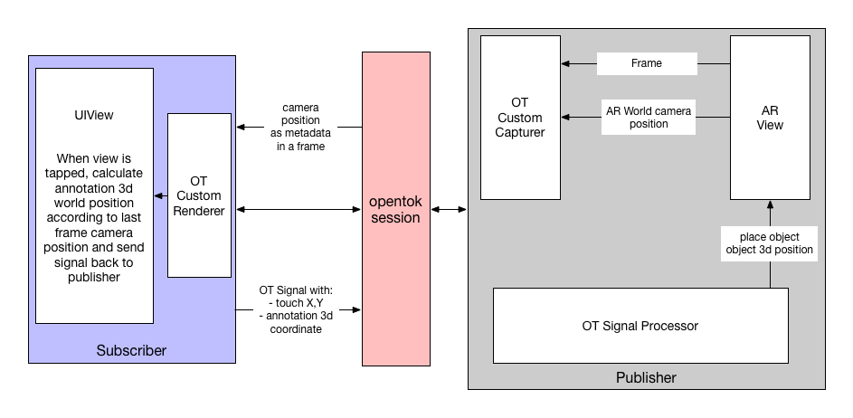

# AR Remote anotation using OpenTok FrameMetadata API


This iOS application shows a use case where a remote participant can set 3D annotations in the AR view of a publisher.

One of the applications of this sample could be in the insurance sector, where an agent can set annotations in the "world" of the publisher who is streaming a car which has been involved in some kind of accident.

In order to increase the accuracy of the annotations, this sample uses the Frame Metadata API to embed the coordinates of the camera that is created in the virtual world of the AR scene of the publisher in each frame. That way, when a subscriber clicks on their screen to create an annotation in the world of the publisher, the application will precisely know the position of the publisher.

## Running the sample

1. Install the required dependencies by running:

`$ pod install`

2. Open the workspace the CocoaPods will create.
3. Get a token, sessionId and fill in along with your api key in the file `ARFrameMetadata/OTConstants.swift`
4. Run the application

You will require two instances of the app running, one for the publisher and another for the subscriber. When the application starts it asks you to select with role will be each device.

When both applications are running, you will see that the AR Scene of the publisher is being streamed to the subscriber, in the subscriber lower part of the screen you will see the camera coordinates that come with each frame. When you tap on the subcriber side, you will see that a annotation (with the shape of a pokeball or a star) will appear in the publisher side in the same position you tapped the screen.

Please note that for the sake of simplicity of the sample, the depth where the annotation is fixed.

## App Architechture

Since this is an iOS app and we are dealing with AR scenarios, we use ARKit to create the objetcts in the virtual world it creates.

As noted above, we use the new [framemetadata API](https://tokbox.com/developer/sdks/ios/reference/Classes/OTVideoFrame.html#//api/name/metadata) that comes with OpenTok 2.14.



In this diagram we show a brief schema on how the app works. In the publisher we use a ARSCNView which is a SCNKit scene with AR capabilities powered by ARKit. That view will feed with the view of the back camera and the AR Scene to a custom capturer that our Publisher will use to send frames to the subscriber. The custom capturer will bundle in the frame the camera 3d position and rotation in the frame metadata and will send it to the subscriber using the OpenTok sdk.

In the subscriber side, the frame will be shown. When the subscriber taps the view to create an annotation, the view will capture the x and y position of the touch, and using the 3d camera position of the publisher which is bundled in each frame will calculate the 3d position of the annotation. Once that position is calculated, the subscriber will send a signal to the publisher using the OpenTok SDK with this position of the annotation.

When the publisher receives the signal it adds the annotation to the AR world, so it can be seen both by the publisher and subscriber.

## Code walkthrough

The sample has two main ViewControllers, PublisherViewController and SubscriberViewController that control each role of the app.

### PublisherViewController

The role of this view controller is to hold the AR Session and render the world using SCNKit.

For the frame metadata api part, we use a custom capturer similar to the [custom video driver swift sample](https://github.com/opentok/opentok-ios-sdk-samples-swift/tree/master/Custom-Video-Driver). The most important modifications of that sample is that we added the capability of capturing the SCNKit frame along with the camera input, and the add of a delegate that is called just before the frame is shipped to the underlying opentok sdk.

In the `PublisherViewController` class we implement the delegate and pack the camera information in the frame metadata.

Since the limitation of the metadata is 32 bytes, we pack the float numbers in a Data array by using this code:

```swift
extension PublisherViewController: SCNViewVideoCaptureDelegate {
    func prepare(videoFrame: OTVideoFrame) {
        let cameraNode = sceneView.scene.rootNode.childNodes.first {
            $0.camera != nil
        }
        if let node = cameraNode, let cam = node.camera {
            let data = Data(fromArray: [
                node.simdPosition.x,
                node.simdPosition.y,
                node.simdPosition.z,
                node.eulerAngles.x,
                node.eulerAngles.y,
                node.eulerAngles.z,
                Float(cam.zNear),
                Float(cam.fieldOfView)
                ])

            var err: OTError?
            videoFrame.setMetadata(data, error: &err)
            if let e = err {
                print("Error adding frame metadata: \(e.localizedDescription)")
            }
        }
    }
}
```

If you want to take a look on how we convert an array of Float to data, please take a look to `Data+fromArray.swift` file.

In this class we have the code to add elements when the subscriber signals it.

The content of the signal from the subscriber will be:

`AnnotationX:AnnotationY:AnnotationZ:TapX:TapY`

With that information, we use two utilities methods from SCNKit: `projectPoint` and `unprojectPoint` to transform the 2D position of the tap and the object 3D position to calculate the final position of the annotation.

```swift
let nodePos = signal.split(separator: ":")
if  nodePos.count == 5,
    let newNodeX = Float(nodePos[0]),
    let newNodeY = Float(nodePos[1]),
    let newNodeZ = Float(nodePos[2]),
    let x = Float(nodePos[3]),
    let y = Float(nodePos[4])
{
    newNode.simdPosition.x = newNodeX
    newNode.simdPosition.y = newNodeY
    newNode.simdPosition.z = newNodeZ
    let z = sceneView.projectPoint(newNode.position).z
    let p = sceneView.unprojectPoint(SCNVector3(x, y, z))
    newNode.position = p

    sceneView.scene.rootNode.addChildNode(newNode)
}
```

### SubscriberViewController

The main role of this class is to get the frame from the publisher, render it and when a tap is made, signal the publisher with the position of the annotation.

For the rendering we use the same renderer that the custom video driver sample, but adding delegation capability so it can expose the frame metadata throught it.

The delegate saves the publisher scene camera with this code:

```swift
guard let metadata = videoFrame.metadata else {
    return
}

let arr = metadata.toArray(type: Float.self)
let cameraNode = SCNNode()
cameraNode.simdPosition.x = arr[0]
cameraNode.simdPosition.y = arr[1]
cameraNode.simdPosition.z = arr[2]

cameraNode.eulerAngles.x = arr[3]
cameraNode.eulerAngles.y = arr[4]
cameraNode.eulerAngles.z = arr[5]

cameraNode.camera = SCNCamera()
cameraNode.camera?.zFar = CAMERA_DEFAULT_ZFAR
cameraNode.camera?.zNear = Double(arr[6])
cameraNode.camera?.fieldOfView = CGFloat(arr[7])

self.lastNode = cameraNode
```

Please take a look to the section above where the Publisher bundled this information in the frame.

When the view is tapped, we calculate the annotation position and with this code:

```swift
guard let lastCamera = lastNode else {
    return
}
let loc = recoginizer.location(in: view)
let nodePos = lastCamera.simdWorldFront * FIXED_DEPTH

otSession.signal(withType: "newNode", string: "\(nodePos.x):\(nodePos.y):\(nodePos.z):\(loc.x):\(loc.y)", connection: nil, error: nil)
```

## Closing comments and references

Usually ARKit is combined with either Scene Kit or Sprite Kit, this sample uses Scene Kit to display 3D Content. You will find the 3d Scenes in `art.scnassets` folder.

If you want to see other uses of ARKit and Opentok, please take a look to our other samples:

* https://github.com/opentok/ARKitSample
* https://github.com/robjperez/OTPublishARSample
